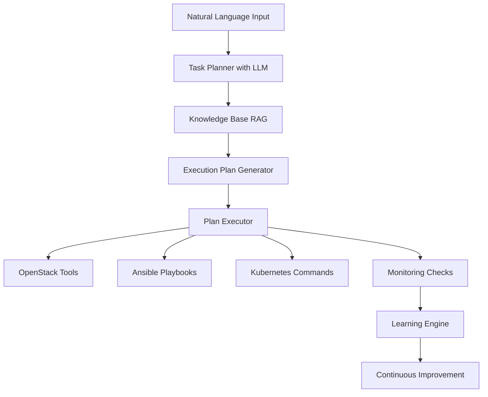

# OpenstackAIOpsAgent 

> **Intelligent Cloud Operations Agent** - An autonomous AI system for OpenStack infrastructure management using natural language processing and advanced automation.


##  Overview

AIOps-Agent is an advanced autonomous AI system developed during my engineering internship at a cloud startup. This project represents the cutting edge of AIOps (Artificial Intelligence for IT Operations), combining Large Language Models (LLMs), Retrieval-Augmented Generation (RAG), and cloud automation to create an intelligent operator capable of managing OpenStack infrastructure through natural language commands.

**Key Innovation**: Unlike traditional chatbots, this agent actually executes real infrastructure operations, bridging the gap between human intent and cloud automation.

##  Mission & Vision

The agent transforms natural language requests like *"Deploy a web server with NGINX and configure firewall rules"* into concrete infrastructure actions, reducing operational overhead and accelerating deployments.

### Core Objectives
- **Natural Language Processing**: Interpret complex infrastructure requests in French/English
- **Autonomous Task Decomposition**: Break down complex operations into executable steps
- **Multi-Cloud Integration**: Support OpenStack, Kubernetes, and Ansible automation
- **Continuous Learning**: Improve performance through execution history analysis
- **24/7 Autonomous Monitoring**: Detect and resolve infrastructure issues automatically

##  Architecture



### Key Components

- **Intelligent Task Planner**: Uses Google Gemini LLM for request decomposition
- **Advanced RAG System**: Knowledge base with semantic search using SentenceTransformers
- **Multi-Tool Integration**: OpenStack API, Ansible, Kubernetes, monitoring tools
- **Learning Engine**: SQLite-based analytics for performance optimization
- **Autonomous Mode**: Continuous infrastructure monitoring and auto-remediation

## Features

### Core Capabilities
- **Natural Language Commands**: Process requests in human language
- **Infrastructure Automation**: VM creation, network configuration, security groups
- **Application Deployment**: Automated web server, Docker, Kubernetes deployments
- **Intelligent Planning**: Dependency resolution and execution ordering
- **Error Recovery**: Automatic fallback plans and error handling
- **Knowledge Management**: Searchable documentation and best practices

### Advanced Features
-  **Autonomous Operations**: Self-healing infrastructure monitoring
-  **Performance Learning**: Execution history analysis and optimization
-  **Smart Diagnostics**: Automatic issue detection and resolution
-  **Dynamic Inventory**: OpenStack-integrated Ansible inventory
-  **Simulation Mode**: Safe testing without affecting production

##  Technology Stack

| Component | Technology | Purpose |
|-----------|------------|---------|
| **AI/ML** | Google Gemini LLM | Natural language understanding |
| **Vector DB** | ChromaDB | Knowledge base and RAG |
| **Embeddings** | SentenceTransformers | Semantic search |
| **Cloud** | OpenStack SDK | Infrastructure management |
| **Orchestration** | Ansible | Configuration management |
| **Containers** | Kubernetes | Container orchestration |
| **Database** | SQLite | Learning and analytics |
| **UI** | Rich Console | Interactive command interface |

##  Installation

### Prerequisites
- Python 3.9+
- OpenStack environment with API access
- Google Gemini API key
- Optional: Kubernetes cluster, Ansible

### Quick Setup

```bash
# Clone the repository
git clone https://github.com/yourusername/AIOps-Agent.git
cd AIOps-Agent

# Create virtual environment
python -m venv venv
source venv/bin/activate  # On Windows: venv\Scripts\activate

# Install dependencies
pip install -r requirements.txt

# Configure environment
cp .env.example .env
# Edit .env with your credentials
```

### Environment Configuration

```bash
# .env file
GOOGLE_API_KEY=your_gemini_api_key
OS_CLOUD=your_openstack_cloud_name
SIMULATE=1  # Set to 0 for production mode
```

### OpenStack Configuration

Create `clouds.yaml` in your project root:

```yaml
clouds:
  openstack:
    auth:
      auth_url: https://your-openstack-url:5000/v3
      username: your_username
      password: your_password
      project_name: your_project
      user_domain_name: default
      project_domain_name: default
    region_name: RegionOne
    interface: public
```

##  Usage

### Interactive Mode
```bash
python openstack_agent.py
```

### Example Commands
- *"Créé un serveur web avec NGINX"*
- *"Deploy a Kubernetes cluster with monitoring"*
- *"Check infrastructure health and fix any issues"*
- *"Create 3 VMs with load balancer configuration"*

### Programmatic Usage
```python
from agent import AutonomousAgent
import openstack
from langchain_google_genai import GoogleGenerativeAI

# Initialize
conn = openstack.connect(cloud="openstack")
llm = GoogleGenerativeAI(model="gemini-1.5-flash")
agent = AutonomousAgent(conn, llm)

# Process request
result = agent.process_natural_request("Deploy a web application")
print(f"Success: {result['success']}")
```

##  Project Structure

```
AIOps-Agent/
├── agent.py              # Main agent implementation
├── knowledge/             # RAG knowledge base
├── playbooks/            # Ansible automation
├── inventory/            # Dynamic inventory scripts
├── chromadb/             # Vector database
├── requirements.txt      # Python dependencies
├── .env.example          # Environment template
└── docs/                 # Documentation
```

##  Research & Development

This project implements several advanced concepts:

### RAG (Retrieval-Augmented Generation)
- Semantic search over technical documentation
- Context-aware response generation
- Dynamic knowledge updates

### Autonomous Task Planning
- LLM-powered request decomposition
- Dependency graph resolution
- Execution plan optimization

### Continuous Learning
- Performance metrics collection
- Pattern recognition and optimization
- Self-improving execution strategies

##  Metrics & Analytics

The agent tracks comprehensive performance metrics:
- Execution success rates
- Task completion times
- Error patterns and resolutions
- Usage analytics and optimization opportunities

##  Development

### Running Tests
```bash
# Simulation mode for safe testing
SIMULATE=1 python openstack_agent.py

# Run specific component tests
python -m pytest tests/
```

### Contributing
1. Fork the repository
2. Create a feature branch
3. Implement changes with tests
4. Submit a pull request

### Code Quality
- Type hints throughout the codebase
- Comprehensive error handling
- Detailed logging and monitoring
- Rich console interface for better UX

## Future Roadmap

-  Web UI dashboard
-  Advanced security scanning
-  Cost optimization recommendations
-  Integration with monitoring tools (Prometheus, Grafana)
-  Workflow scheduling and orchestration
-  API REST for external integrations


##  Acknowledgments

Developed during my engineering internship at a cloud startup as part of advanced R&D in AIOps. Special thanks to the DevOps team for their guidance and the opportunity to work on cutting-edge cloud automation technology.

##  License

This project is licensed under the MIT License - see the [LICENSE](LICENSE) file for details.

